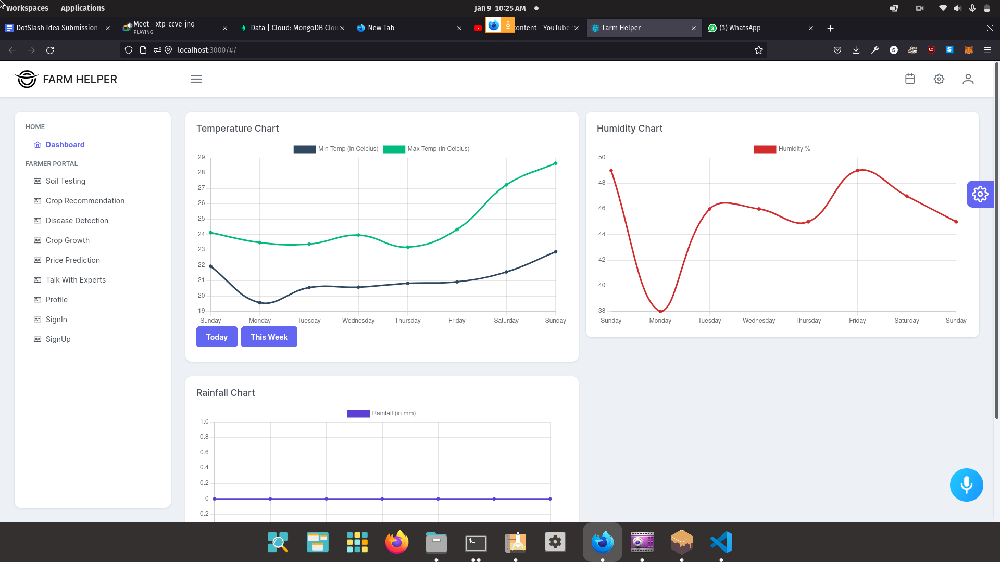
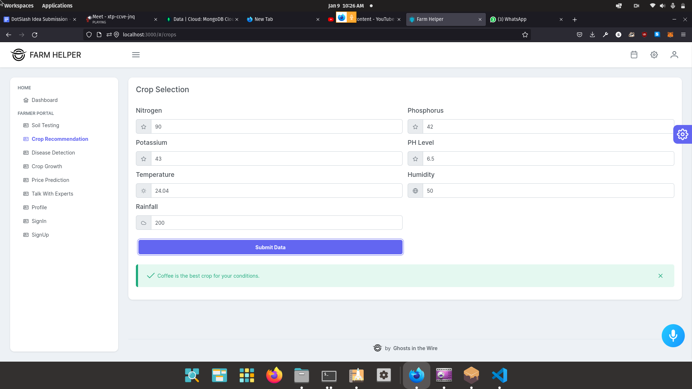
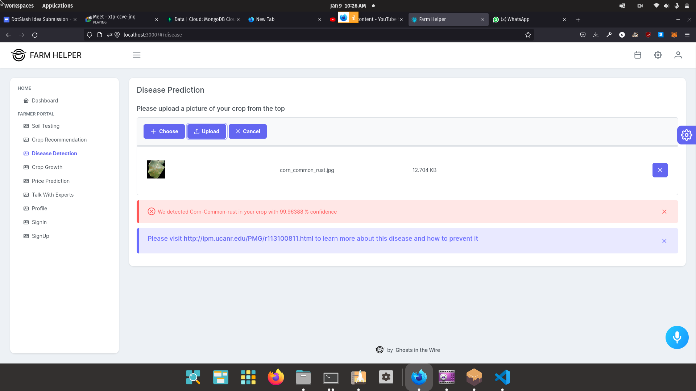
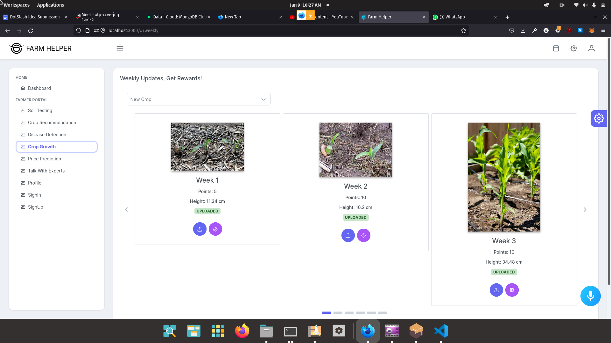
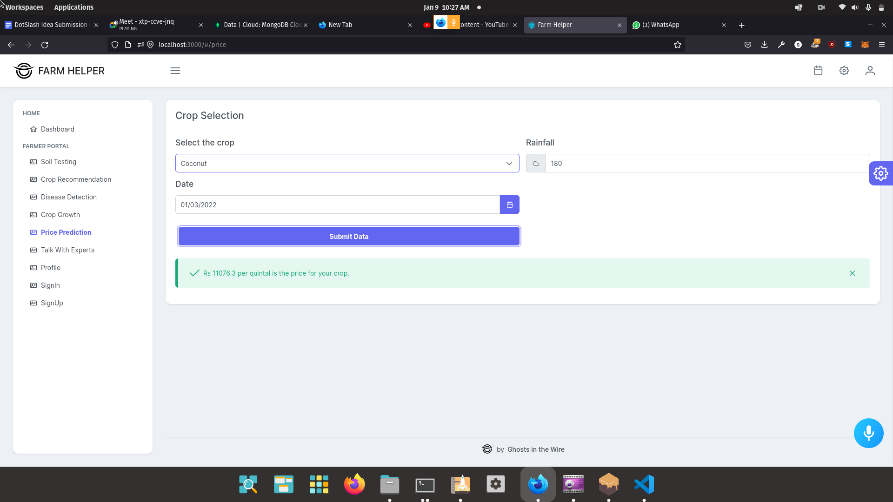

# DotSlash5.0
We are helping farmers in every stage of farming from crop selecting to monitor the growth, for which we are providing:
<ol>
<li>Nearby soil testing laboratories in map</li>
<li>Crop recommendation from soil nutrition and weather data of current location </li>
<li>Gamified plant growth monitoring</li>
<li>Plant disease detection from leaves images and pesticides recommendation</li>
<li>Price prediction of crop based on location</li>
<li>Connect with experts via video call</li>
<li>Ecommerece market place to redeem the coins received during crop growth mentoring</li>
<li>Real time weather parameters like temperature, humidity etc and alerts based on location</li>

  

